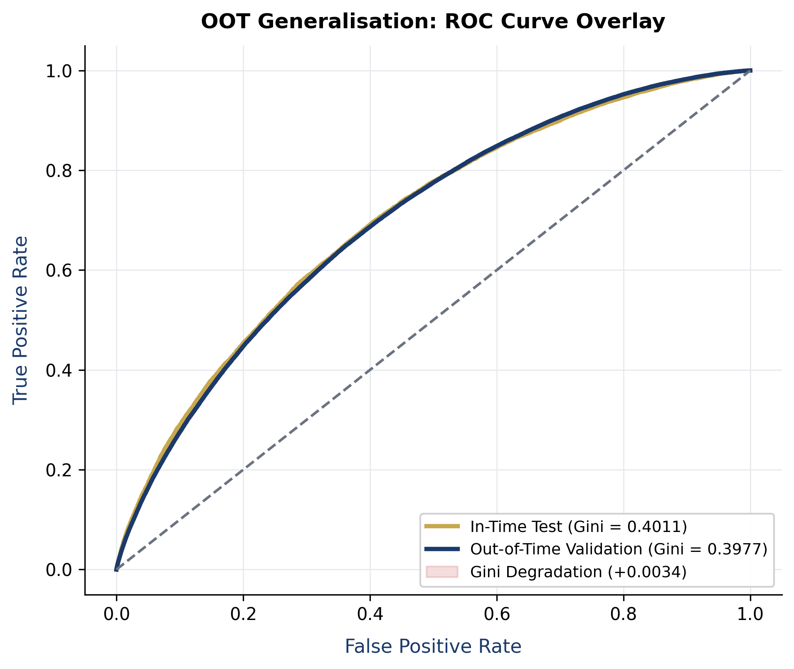
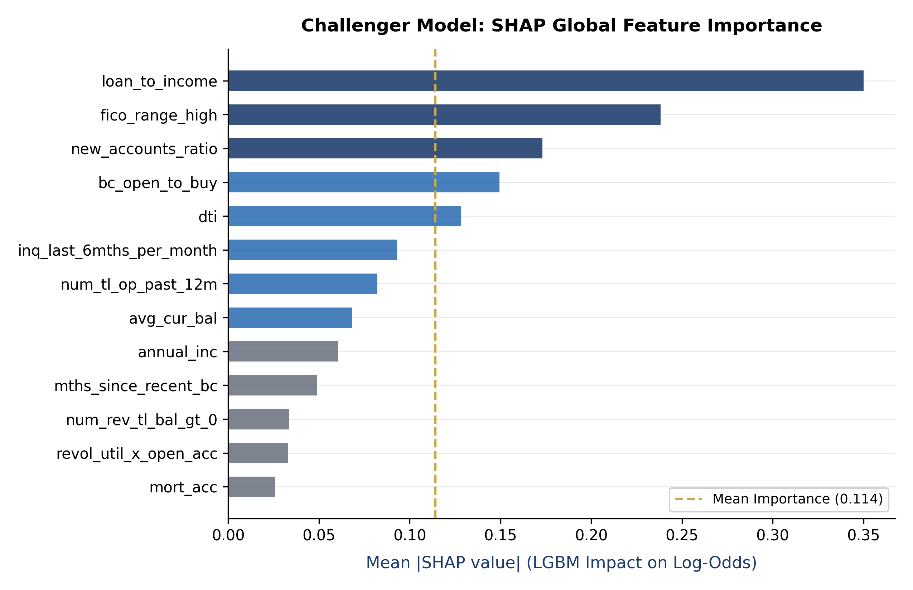
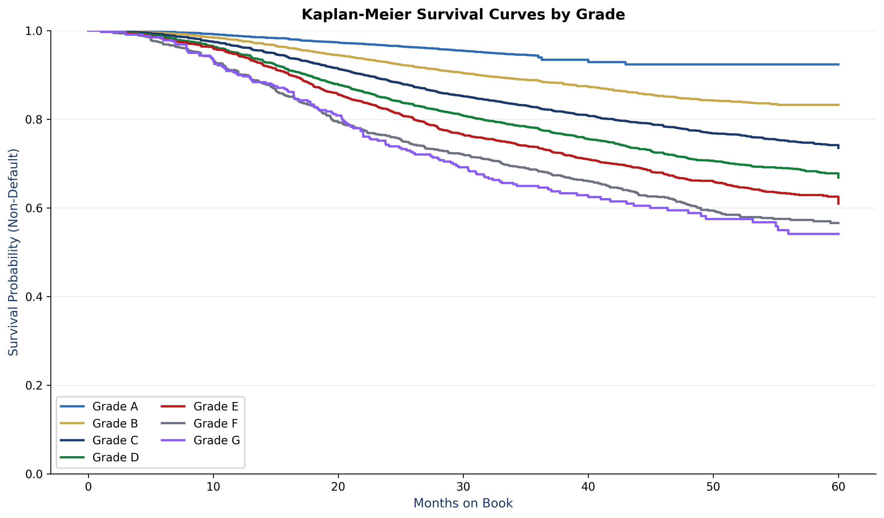
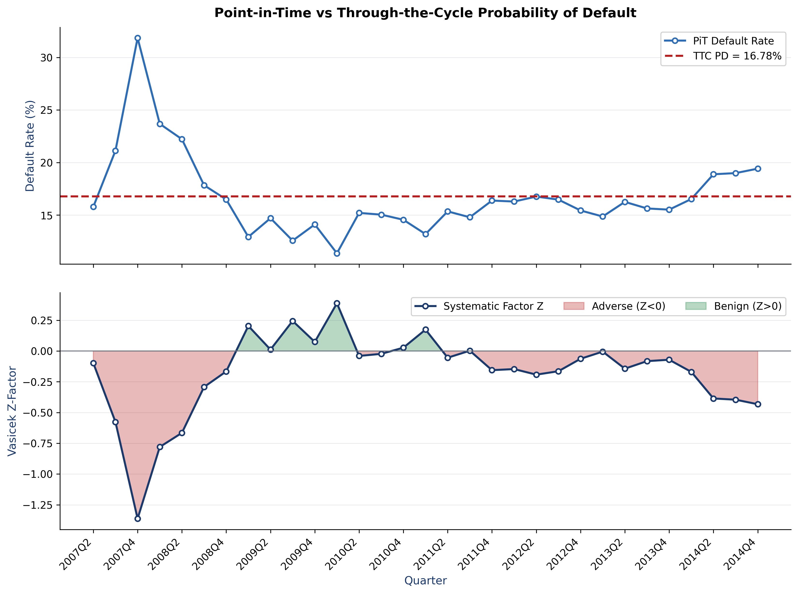
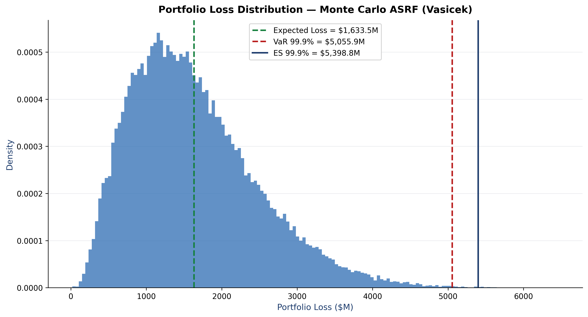
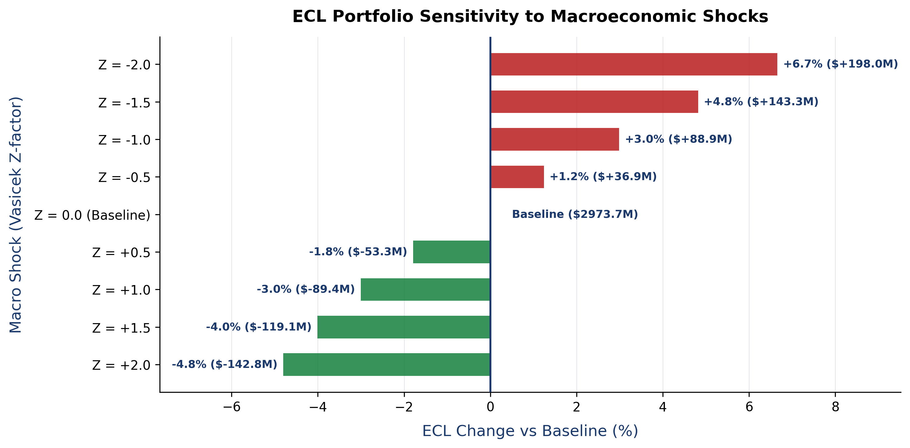

# IFRS 9 Credit-Risk & ECL Engine

**PD scorecard · LGD/EAD · Basel IRB capital · 3-stage IFRS 9 ECL — on 2.26M Lending Club loans.**


End-to-end credit risk pipeline implementing a PD scorecard (WoE + logistic
regression), LGD & EAD models, Basel IRB capital, and an IFRS 9 three-stage ECL
engine on Lending Club data.

---

## Key Results

Latest full real-data run (Lending Club 2007–2018, ~2.26M accepted loans). To
regenerate: `python -m credit_risk.pipeline`, then `make readme` (or
`python scripts/update_readme_metrics.py`) to rewrite the table below from
`outputs/metrics.json`.

<!-- METRICS:START -->
| Metric | Value |
|--------|-------|
| PD AUC (OOT) | 0.699 |
| Gini (OOT) | 0.398 |
| KS (OOT) | 0.287 |
| PSI (train → OOT) | 0.003 |
| Mean LGD (OOS-selected model) | 0.893 |
| Downturn LGD (p90) | 0.907 |
| Portfolio EL | $1.63bn |
| Total RWA (IRB) | $17.76bn |
| RWA density | 188.2% |
| Total IFRS 9 ECL | $3.00bn |
| ECL coverage | 31.8% |
| Stage 2 / Stage 3 share | 29.4% / 21.5% |
| Operating cut-off | score 530 (61.4% approval, 13.8% bad rate, RAROC -36.4%) |
<!-- METRICS:END -->

> The recommended operating cutoff is the most inclusive score that keeps the
> approved bad rate within the 15% risk-appetite ceiling — it is *not* the
> profit-maximising cutoff. At correctly-annualised expected loss its RAROC is
> negative, meaning the current risk-appetite ceiling is looser than the
> profitable region of the grid; see the model-risk report's cutoff section
> for the full 400–800 sweep.

> Benchmark comparisons against published literature are computed at report-build time
> (some metrics sit above/below published ranges by design — see the model-risk report,
> Tables 13 & 18, and `reports/benchmarks.py`).

---

## Key Visualizations

<table>
<tr>
<td width="50%">

**ROC — in-time vs out-of-time** (Gini 0.401 → 0.398)


</td>
<td width="50%">

**SHAP feature importance** — top PD drivers


</td>
</tr>
<tr>
<td width="50%">

**Kaplan–Meier survival by grade** — PD term-structure basis


</td>
<td width="50%">

**Point-in-time vs through-the-cycle PD** — macro link for IFRS 9 SICR


</td>
</tr>
<tr>
<td width="50%">

**Portfolio loss distribution** — VaR 99.9% $5.06bn, ES $5.40bn


</td>
<td width="50%">

**IFRS 9 ECL sensitivity to macro shocks** — ±2 Z-factor vs $2.97bn baseline


</td>
</tr>
</table>

More figures (calibration, PSI, PDP/ICE, cutoff/RAROC) live under `reports/figures/`
and `reports/figures/validation/`, and are embedded in the full `reports/model_risk_report.pdf`.

---

## Repository Structure

```
credit-risk-ecl/
├── README.md
├── pyproject.toml / requirements.txt
├── Makefile
├── .pre-commit-config.yaml
├── config/config.yaml          # all parameters, seeds, thresholds
├── data/{raw,interim,processed}/
├── src/credit_risk/
│   ├── data/                   # download, load, clean, split
│   ├── features/               # WoE/IV binning, transformers
│   ├── models/                 # PD scorecard, LGD, EAD, term structure
│   ├── risk/                   # EL, Basel IRB, IFRS 9 ECL
│   ├── validation/             # discrimination, calibration, PSI, OOT
│   ├── business/               # cutoff optimisation, reject inference
│   ├── reporting/              # Jinja2 → PDF
│   └── utils/                  # logging, config
├── reports/
│   ├── figures/
│   └── model_risk_report.pdf
├── tests/
└── outputs/                    # serialised models, metrics JSON, parquet
```

---

## Setup

**Prerequisites:** Python 3.11+, a Kaggle account.

```bash
# 1. Clone and install
git clone <repo>
cd credit-risk-ecl
make setup

# 2. Kaggle credentials (needed for real data)
#    Download your kaggle.json from https://www.kaggle.com/settings → API
#    Place at:  %USERPROFILE%\.kaggle\kaggle.json  (Windows)
#               ~/.kaggle/kaggle.json               (Linux/macOS)

# 3. Download Lending Club data (~1.5 GB)
make data-download

# 4. Run full pipeline (Phases 1–9)
make pipeline

# 5. Generate PDF report
make report
```

---

## Running Tests

Tests use a synthetic dataset — no CSVs required:

```bash
make test
make lint
```

---

## Configuration

All parameters live in `config/config.yaml`.  Key switches:

| Key | Default | Description |
|-----|---------|-------------|
| `data.source` | `real` | `real` uses Kaggle CSVs; `synthetic` generates fake data |
| `random_seed` | `42` | Global seed for reproducibility |
| `scorecard.pdo` | `20` | Points to double the odds |
| `scorecard.base_score` | `600` | Score at base odds |
| `ifrs9.scenarios` | see YAML | Macro scenario weights & shocks |

---

## Methodology Notes

- **Leakage policy:** only features available at loan origination are used for the PD model.
  Post-origination features (`recoveries`, `total_pymnt*`, etc.) are excluded via an explicit
  deny-list in `config.yaml`. See `src/credit_risk/data/leakage.py`.
- **OOT split:** train on vintages before 2015-01-01; OOT on vintages from 2016-01-01.
  No random-date splitting — this mirrors bank model-governance practice.
- **Basel IRB formula:** retail "other retail" supervisory formula (BCBS §328).
  No maturity adjustment for retail. PD floor 0.03%.
- **IFRS 9 ECL:** 3-stage model with SICR (2.5× PD uplift + 30 DPD backstop), discrete
  hazard term structure, discounted at effective interest rate, probability-weighted across
  baseline / upside / downside macro scenarios.

